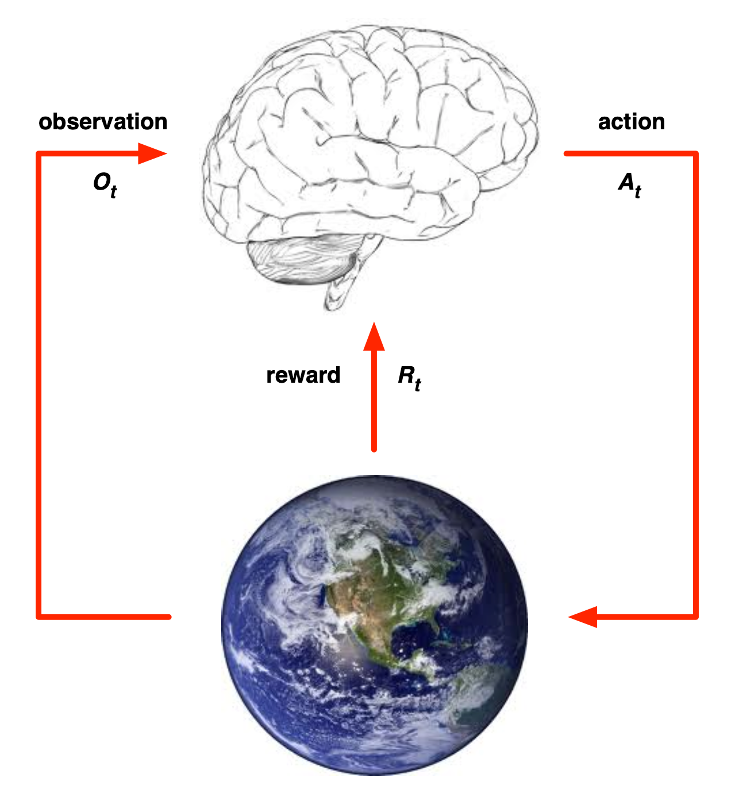
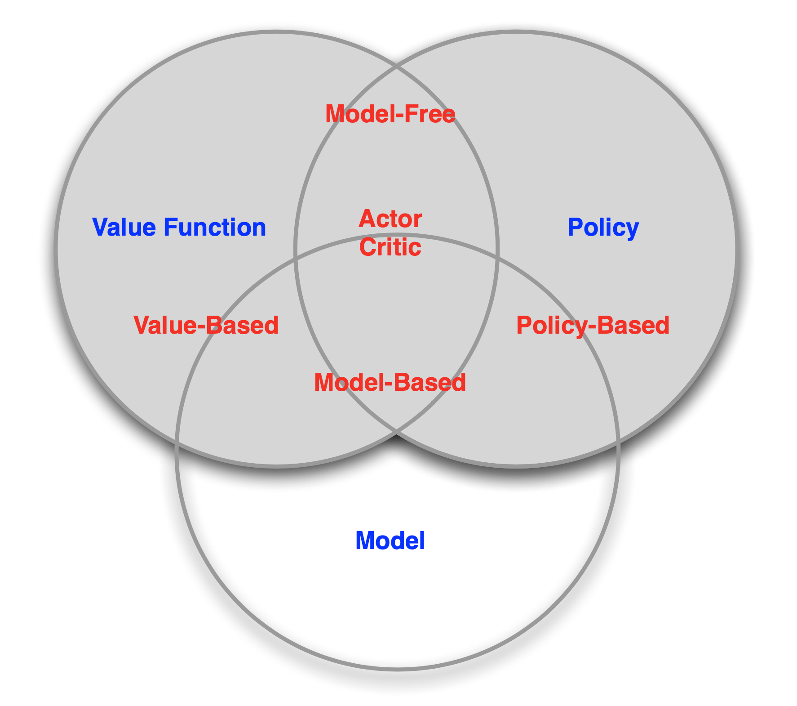

# Introduction to Reinforcement Learning

## The RL Problem

### Rewards

-   A **reward** $R_t$ is a scalar feedback signal
-   It indicates how well the agent is doing at step $t$
-   The agent's job is to maximize the cumulative reward

Reinforcement learning is based on the **reward hypothesis**.

**Definition (Reward Hypothesis)**
All goals can be described by the maximization of the expected cumulative reward.

### Sequential Decision Making

-   Goal: select actions to maximize total future reward
-   Actions may have long-term consequences
-   The reward may be delayed
-   It may be better to sacrifice immediate reward to gain more long-term reward

### Agent and Environment

-   At each step $t$ the agent:
    -   Executes action $A_t$
    -   Receives observation $O_t$
    -   Receives scalar reward $R_t$
-   The environmentL
    -   Receives action $A_t$
    -   Emits observation $O_{t+1}$
    -   Emits scalar reward $R_{t+1}$
-   $t$ increments at environment step

### History and State

-   The **history** is the sequence of observations, actions, and rewards

$$
H_{t}=O_{1}, R_{1}, A_{1}, \ldots, A_{t-1}, O_{t}, R_{t}
$$

-   i.e., the history may contain all observable variables up to time $t$
-   What happens next depends on the history:
    -   The agent selects actions
    -   The environment selects observations/rewards
-   **State** is the information used to determine what happens next
-   Formally, state is a function of the history (we can customize this function)

$$
S_{t}=f\left(H_{t}\right)
$$

#### Environment State

-   The **environment state** $S^e_t$ is the environment's private representation
-   i.e., whatever data the environment uses to pick the next observation/reward
-   The environment state is not usually visible to the agent
-   Even if $S^e_t$ is visible, it may contain irrelevant information

#### Agent State

-   The **agent state** $S^a_t$ is the agent's internal representation
-   i.e., whatever information the agent uses to pick the next action
-   i.e., it is the information used by reinforcement learning algorithms
-   It can be any function of history

$$
S_{t}^{a}=f\left(H_{t}\right)
$$

####  Information State

-   An **information state** (a.k.a. **Markov state**) contains all useful information from the history.

**Definition**
A state $S_t$ is Markov if and only if
$$
\mathbb{P}\left[S_{t+1} | S_{t}\right]=\mathbb{P}\left[S_{t+1} | S_{1}, \ldots, S_{t}\right]
$$

-   "The future is independent of the past given the present"

$$
H_{1: t} \rightarrow S_{t} \rightarrow H_{t+1: \infty}
$$

-   Once the state is known, the history may be thrown away
-   i.e., the state is a sufficient statistic of the future
-   The environment state $S^e_t$ is Markov
-   The history $H_t$ is Markov

### Fully Observable Environments

-   **Full observability**: agent directly observes environment state

$$
O_{t}=S_{t}^{a}=S_{t}^{e}
$$

-   Agent state = encironment state = information state
-   Formally, this is a **Markov decision process (MDP)**

### Partially Observable Environments

-   **Partially observability**: agent indirectly observes environment
-   Now agent state $\neq$ environment state
-   Formally, this is a **partially observable Markov decision process (POMDP)**
-   Agent must construct its own state representation $S^a_t$, e.g.
    -   Complete history: $S^a_t = H_t$
    -   Beliefs of environment state: $S_{t}^{a}=\left(\mathbb{P}\left[S_{t}^{e}=s^{1}\right], \ldots, \mathbb{P}\left[S_{t}^{e}=s^{n}\right]\right)$
    -   Recurrent nerual network: $S_{t}^{a}=\sigma\left(S_{t-1}^{a} W_{s}+O_{t} W_{o}\right)$

## Inside An RL Agent

### Major Compoennts of An RL Agent

An RL agent may include one or more of these components:

-   Policy: agent's behavior function
-   Value function: how good is each state and/or action
-   Model: agent's representation of the environment

#### Policy

-   A **policy** is the agent's behavior
-   It is a map from state to action, e.g.,
    -   Deterministic policy: $a = \pi(s)$
    -   Stochastic policy: $\pi(a | s)=\mathbb{P}\left[A_{t}=a | S_{t}=s\right]$

#### Value Function

-   **Value function** is a prediction of future reward
-   Used to evaluate the goodness/badness of states
-   And therefore to selet between actions, e.g.,

$$
v_{\pi}(s)=\mathbb{E}_{\pi}\left[R_{t+1}+\gamma R_{t+2}+\gamma^{2} R_{t+3}+\ldots | S_{t}=s\right]
$$

#### Model

-   A **model** predicts what the environment will do next
-   $\mathcal{P}^a_{s s^{\prime}}$ predicts the next state
-   $\mathcal{R}$ predicts the next (immediate) reward

$$
\begin{aligned}
\mathcal{P}_{s s^{\prime}}^{a} &=\mathbb{P}\left[S_{t+1}=s^{\prime} | S_{t}=s, A_{t}=a\right] \\
\mathcal{R}_{s}^{a} &=\mathbb{E}\left[R_{t+1} | S_{t}=s, A_{t}=a\right]
\end{aligned}
$$

### Categorizing RL Agents

-   Value based
    -   No policy (implicit)
    -   Value function
-   Policy based
    -   Policy
    -   No value function
-   Actor critic
    -   Policy
    -   Value function
-   Model free
    -   Policy and/or value function
    -   No model
-   Model based
    -   Policy and/or value function
    -   Model

### RL Agent Taxonomy

## Problems Within RL

### Learning and Planning

Two fundamental problems in sequential decision making

-   Reinforcement learning
    -   The environment is initially unknown
    -   The agent interacts with the environment
    -   The agent improves its policy
-   Planning
    -   A model of the environment is known
    -   The agent performs computations with its model (without any external interaction)
    -   The agent improves its policy
    -   a.k.a. deliberation, reasoning, introspection, pondering, thought, search

### Exploration and Exploitaiton

-   Reinforcement learning is like trial-and-error learning
-   The agent should discover a good policy
-   From its experience of the environment
-   Without losing too much reward along the way

-   **Exploration** finds more information about the environment
-   **Exploitation** exploits known information to maximize reward
-   It is usually important to explore as well as exploit

### Prediction and Control

-   **Prediction**: evaluate the future
    -   Given a policy
    -   What is the value function for the uniform random policy?
-   **Control**: optimize the future
    -   Find the best policy
    -   What is the optimal value function over all possible policies?
    -   What is the optimal policy?

